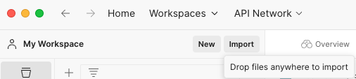

# r2 리소스 서버 예제 프로젝트

-   r2 리소스 서버에 대한 예제 프로젝트입니다.

## 환경

-   Node.js 18 버전
-   [Docker Desktop](https://www.docker.com/products/docker-desktop/)

## 설치 및 실행 방법

-   모듈 설치

    ```
    npm install
    ```

-   개발용 데이터베이스 실행

    -   먼저, Docker Desktop이 실행중인 상태이어야 합니다.
    -   아래 명령 실행 시 에러가 발생하시는 경우 Docker Desktop 및 Docker 엔진이 실행중인지 확인해주세요

    ```
    npm run start:db
    ```

-   테이블 생성 및 샘플 데이터 추가

    ```
    npm run init
    ```

-   리소스 서버 실행
    ```
    npm run start
    ```

## 프로젝트 구성

### 폴더 구조

```
/realreport-server
  ├── knexfile.ts // knex 구성 파일(DB 연결정보, 커넥션풀 설정, ...)
  ├── src // 리얼리포트 리소스 서버 예제
  │    ├── lib/repository // 데이터베이스 접근 로직
  │    ├── public // express 서버에서 제공할
  │    ├── routes // API 핸들러
  │    ├── schema // 데이터베이스 테이블에 대한 타입(select 쿼리에서 사용합니다.)
  │    ├── views // ejs로 작성한 뷰 템플릿
  │    ├── app.ts // express 서버 생성 및 실행을 위한 소스코드
  ├── docker-compose.yml // 개발용 데이터베이스 실행을 위한 docker-compose 파일
```

### 사용 라이브러리

| 이름          | 설명                                                    |
| ------------- | ------------------------------------------------------- |
| express       | 페이지 및 API 핸들러 구현을 위해서 사용합니다           |
| ejs           | express 뷰 템플릿 엔진입니다.                           |
| http-errors   | Express를 위한 HTTP 에러를 만들어주는 라이브러리입니다. |
| cookie-parser | 쿠키 헤더를 파싱하는 라이브러리입니다.                  |
| multer        | 파일 업로드를 위한 라이브러리입니다.                    |
| morgan        | 앱 서버의 Logger 라이브러리입니다.                      |
| knex          | 데이터베이스 접근을 위해 사용합니다.                    |
| pg            | PostgreSQL 커넥터입니다.                                |

### r2 리소스 서버 주요 기능

-   리포트 템플릿 Rest API
-   리포트 템플릿 관리 페이지

#### 리포트 템플릿 관리를 위한 Rest API

-   리포트 템플릿을 관리하기 위한 Rest API입니다.
    -   해당 API를 사용해서 리얼리포트 웹 디자이너와 연동하실 수 있습니다.
    -   연동 방법은 해당 레포지토리의 web-designer-integration-example
-   Rest API에 대한 사용방법은 postman 컬렉션으로 제공해드립니다.
-   `postman/R2리소스 서버.postman_collection.json`파일을 Postman 프로그램에 import 하신 후 이용 가능합니다.  
    

#### 리포트 템플릿 관리 페이지

-   리포트 템플릿을 목록조회, 업로드, 다운로드, 삭제하는 기능을 제공합니다.
-   리포트 템플릿의 이름, 경로를 수정할 수 있습니다.
-   `npm run start`로 개발 서버를 실행하신 후, [링크](http://localhost:3000/reports)로 접속해주세요
